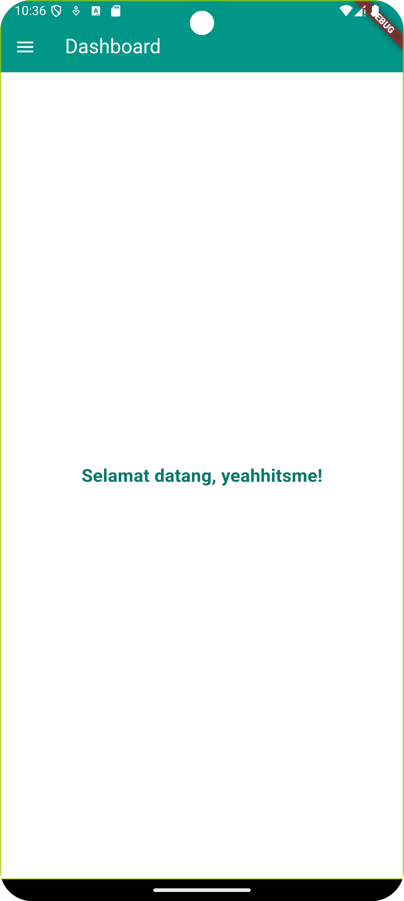

# Aplikasi Catatan - Your Secret

Aplikasi ini adalah aplikasi sederhana untuk catatan menggunakan Flutter. Aplikasi ini memiliki fitur login, dashboard, dan side menu.

## Struktur Proyek

### 1. `main.dart`
File utama aplikasi yang mengatur rute dan tema aplikasi.

- **Fungsi Utama**:
    - Menginisialisasi aplikasi dengan tema teal.
    - Menentukan rute untuk halaman login dan dashboard.

```
void main() {
  runApp(const MyApp());
}
```

### 2. `login_page.dart`
Halaman login yang mengautentikasi pengguna.

- **Komponen Utama**:
    - TextEditingController: Mengontrol input dari pengguna untuk username dan password.
    - Fungsi _login(): Memvalidasi username dan password. Jika valid, menyimpan username menggunakan SharedPreferences dan mengalihkan ke dashboard.
    - UI: Menampilkan ikon, teks judul, dan dua field input untuk username dan password.

```
Future<void> _login() async {
  if (_usernameController.text.isNotEmpty && _passwordController.text == '12345') {
    SharedPreferences prefs = await SharedPreferences.getInstance();
    await prefs.setString('username', _usernameController.text);
    Navigator.pushReplacementNamed(context, '/dashboard');
  }
}
```

### 3. `dashboard_page.dart`
Halaman dashboard yang menyambut pengguna setelah login.

- **Komponen Utama**:
    - SharedPreferences: Memuat username yang disimpan untuk ditampilkan di dashboard.
    - UI: Menampilkan pesan selamat datang menggunakan username yang telah disimpan.

```
Future<void> _loadUsername() async {
  SharedPreferences prefs = await SharedPreferences.getInstance();
  setState(() {
    _username = prefs.getString('username') ?? 'Guest';
  });
}
```

### 4. `sidemenu.dart`
Menu samping (drawer) yang menyediakan navigasi di dalam aplikasi.

- **Komponen Utama**:
    - Drawer: Menyediakan akses ke halaman dashboard dan opsi logout.
    - Fungsi _logout(): Menghapus username dari SharedPreferences dan kembali ke halaman login.

```
Future<void> _logout(BuildContext context) async {
  SharedPreferences prefs = await SharedPreferences.getInstance();
  await prefs.remove('username');
  Navigator.pushReplacementNamed(context, '/');
}
```

**Screenshot**




